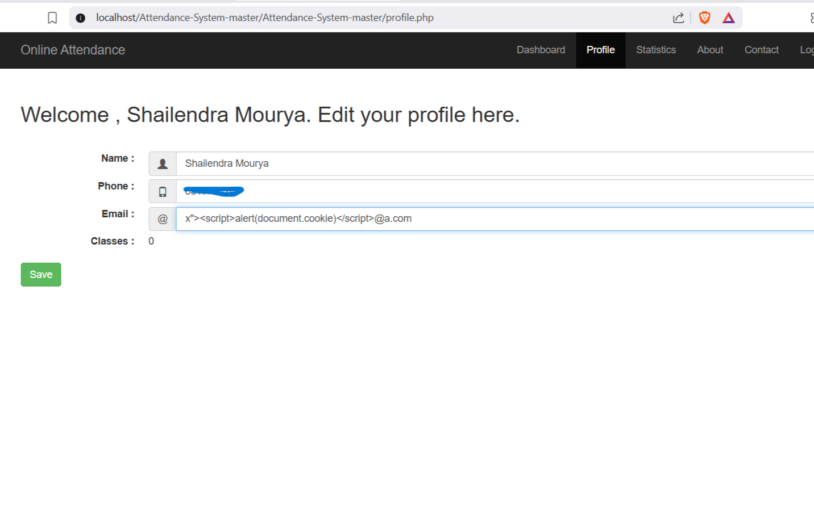
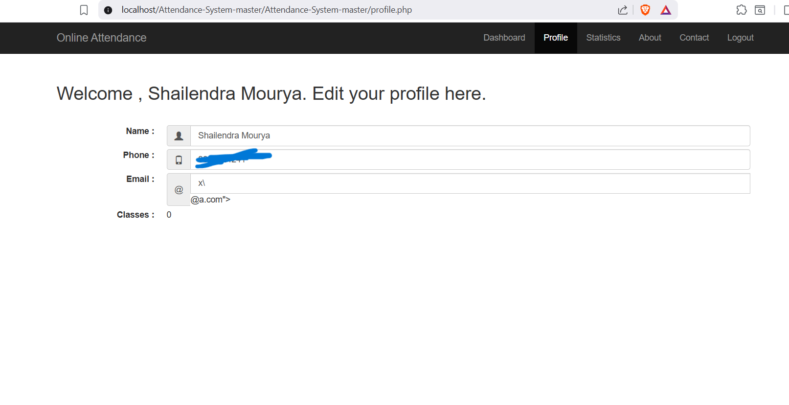
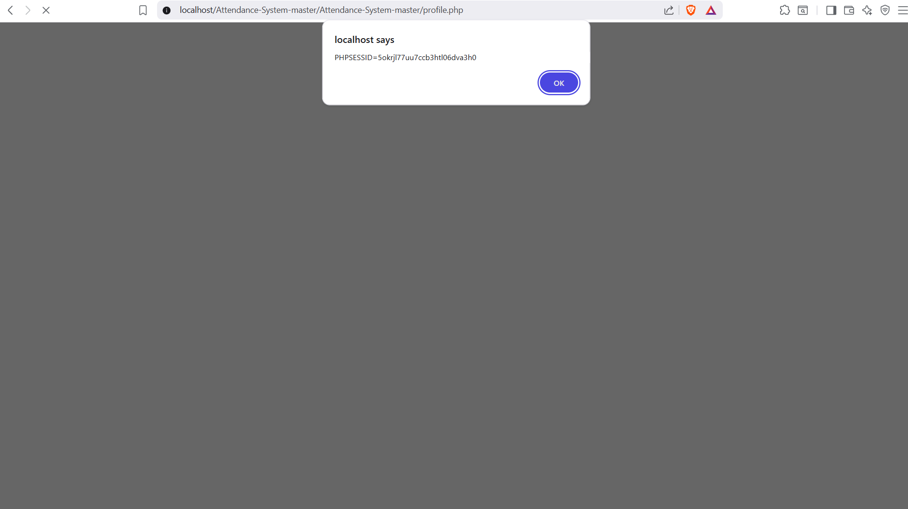

# Stored Cross-Site Scripting (XSS) in Projectworlds Online Attendance System
 
**Researcher:** Shailendra Mourya [CyberShailendra](https://github.com/CyberShailendra1)

**Contact:** cybershailendra1@gmail.com

**Target:** Projectworlds — Online Attendance System in PHP (v1.0)[https://projectworlds.com/free-projects/php-projects/online-attendance-system-php-mysql-bootsrap/]

**Component:** Profile management (`profile.php`, `php/update_profile.php`, `php/process_signup.php`)

**Vulnerability class:** Stored Cross-Site Scripting (CWE-79)

**Severity:** High (CVSS 3.1: **8.0** — see scoring below)

**Testing type:** Authorized — static source review + dynamic verification on a self-hosted local instance

**Disclosure status:** Coordinating with maintainer before publishing full request/response PoC
 
> This write-up documents methodology, root cause, and impact. The exact raw request/response capture is withheld pending maintainer coordination, in line with responsible disclosure practice. It will be added once coordination concludes or a public disclosure deadline is reached.
 
---
 
## Table of Contents
- [Summary](#summary)
- [Affected Components](#affected-components)
- [Root Cause](#root-cause)
- [Attack Prerequisites](#attack-prerequisites)
- [Methodology](#methodology)
- [Proof of Concept](#proof-of-concept)
- [Impact](#impact)
- [CVSS Scoring](#cvss-scoring)
- [Remediation](#remediation)
- [Disclosure Timeline](#disclosure-timeline)
- [Disclaimer](#disclaimer)
---
 
## Summary
 
The Attendance System's profile-update flow accepts an `email` field that is validated with an overly permissive regular expression. The regex only rejects whitespace characters — it does not reject `<`, `>`, `"`, or `'`. As a result, an attacker-controlled value containing an HTML/JavaScript payload can be stored as a user's "email" and is later reflected **unescaped** inside an HTML attribute on `profile.php`. This breaks out of the attribute context and results in **stored XSS**, executing every time the victim (or anyone else who can view that rendered page) loads the profile.
 
Independently, the application's session cookie (`PHPSESSID`) is issued **without the `HttpOnly` flag**, which means the injected script can read `document.cookie` directly — escalating this from a cosmetic injection bug into a full **session hijacking** primitive.
 
---
 
## Affected Components
 
| File | Role |
|---|---|
| `php/defines.php` | Contains the `verify()` helper and the weak `EMAIL` regex |
| `php/process_signup.php` | Accepts email input at registration time, validated by the same weak regex |
| `php/update_profile.php` | Accepts email input at profile-update time, validated by the same weak regex; persists it to the database |
| `profile.php` | Renders the stored email value into an HTML `value="..."` attribute without output encoding |
 
---
 
## Root Cause
 
The email format validator is effectively:
 
```
^([\S]+)@([\S]+)\.([\S]+)$
```
 
`\S` matches *any non-whitespace character* — so `<`, `>`, `"`, `'`, and other HTML-significant characters all satisfy the pattern as long as there's no literal space. Any string shaped loosely like `something@something.something`, with no whitespace, passes.
 
The stored value is later written into the DOM like this (simplified):
 
```html
<input class="form-control" name="email" ... value="<?= $row['email'] ?>">
```
 
There is no `htmlspecialchars()` (or equivalent output encoding) applied. A crafted value such as:
 
```
x"><script>alert(document.cookie)</script>@a.com
```
 
passes the regex (no whitespace), gets stored as-is, and when rendered, the `"` closes the `value` attribute early. Everything after it — including the `<script>` tag — is parsed as live markup rather than attribute text, so the script executes in the victim's browser session.
 
**Contributing factor:** `PHPSESSID` is set without `HttpOnly`, confirmed both via Nikto scan and manual inspection in DevTools → Application → Cookies. This means client-side JavaScript (including the injected payload) can read the session cookie directly via `document.cookie`.
 
---
 
## Attack Prerequisites
 
- Attacker needs the ability to authenticate as *any* user (e.g., a teacher account) that can reach the profile-update endpoint — no elevated privilege is required.
- No CSRF protection is needed for exploitation to be *stored*, since the attacker is updating their own profile — the payload then fires against anyone who views that rendered profile page with sufficient trust context (e.g., an admin viewing a user list/profile, or the same user's own subsequent visits).
- Victim (or attacker's own session, for self-XSS-to-hijack demonstration) simply needs to load `profile.php` while authenticated.
---
 
## Methodology
 
1. **Authenticate** using a normal, legitimately-obtained account via the application's own login flow (`php/process_login.php`), capturing the session cookie issued (`PHPSESSID`).
2. **Submit the profile-update form** (`php/update_profile.php`) with a crafted `email` value designed to satisfy the loose regex while containing an HTML/JS breakout payload.
3. **Confirm persistence** — the endpoint returns a success response, and the payload is now stored server-side.
4. **Trigger and diff** — request `profile.php` and compare the rendered HTML against a baseline (clean-value) request. The crafted value appears verbatim, unescaped, inside the `value` attribute of the email `<input>`, breaking out of the attribute.
5. **Visual confirmation in-browser** — loaded `profile.php` in an actual browser (not just HTTP tooling) while authenticated. The injected `<script>` executed, popping an `alert()` containing `document.cookie` — visual proof of live code execution, not just reflected markup.
6. **Confirmed the escalation path** — inspected `Application → Cookies` in DevTools and verified `PHPSESSID` has no `HttpOnly` flag set, meaning the same injection point could instead exfiltrate the session cookie to an attacker-controlled endpoint rather than just popping an alert.
7. **Cleaned up** — reverted the email field to a benign value via the same endpoint so no payload persists in the test database.
---
 
## Proof of Concept
 
### Screenshots
 
**1. Payload submitted in the Email field:**
 

 
**2. Payload persisted and reflected back unescaped on reload:**
 

 
**3. Stored XSS firing — `alert(document.cookie)` executes on page load:**
 

 
---
 
## Impact
 
- **Stored XSS** in a page every authenticated user visits by default (their own profile) — no social engineering needed beyond getting the payload stored once.
- **Session hijacking**: because `PHPSESSID` lacks `HttpOnly`, the same injection point can run `fetch()`/`XMLHttpRequest` to exfiltrate the live session cookie to an attacker-controlled collector, allowing full session takeover without the victim's password.
- Depending on where else the `email` field is rendered (e.g., admin-facing user lists, attendance reports, notification emails rendered as HTML), the blast radius may extend beyond the profile page itself to any staff/admin view that displays user records.
- Because the payload is *stored*, it persists across sessions and page loads until explicitly overwritten — every visit re-triggers execution.
---
 
## CVSS Scoring
 
**CVSS v3.1 Vector:** `AV:N/AC:L/PR:L/UI:R/S:C/C:H/I:L/A:N`
**Base Score:** 8.0 (High)
 
| Metric | Value | Rationale |
|---|---|---|
| Attack Vector | Network | Exploitable remotely over HTTP |
| Attack Complexity | Low | No special conditions beyond crafting the payload |
| Privileges Required | Low | Requires only a standard authenticated account |
| User Interaction | Required | Victim must view the affected profile page |
| Scope | Changed | Script executes in victim's browser/session context, not attacker's |
| Confidentiality | High | Session cookie theft → full account takeover |
| Integrity | Low | Attacker can perform actions as the victim post-hijack |
| Availability | None | No direct availability impact |
 
---
 
## Remediation
 
1. **Tighten input validation** — the `EMAIL` regex in `php/defines.php` should reject `<`, `>`, `"`, `'`, and other HTML-significant characters, not just whitespace. Consider using PHP's built-in `filter_var($email, FILTER_VALIDATE_EMAIL)` instead of a hand-rolled regex.
2. **Encode all output** — apply `htmlspecialchars($value, ENT_QUOTES, 'UTF-8')` (or a templating engine with auto-escaping) to every user-controlled value rendered into HTML, including attribute values.
3. **Set `HttpOnly` on the session cookie** — configure `session.cookie_httponly = 1` in `php.ini`, or set it explicitly via `session_set_cookie_params()` before `session_start()`, so client-side scripts cannot read `PHPSESSID` even if an XSS bypass is later found.
4. **Defense in depth** — consider a Content-Security-Policy header restricting inline script execution, and setting `Secure` + `SameSite=Strict` on session cookies.
---
 
## Disclosure Timeline
 
| Date | Event |
|---|---|
| TBD | Vulnerability identified via source review on local instance |
| TBD | Live exploitation confirmed on local instance |
| TBD | Maintainer notified |
| TBD | Awaiting maintainer response / fix |
| TBD | Public disclosure of full PoC (pending) |
 
---
 
## Disclaimer
 
All testing described in this write-up was performed against a **locally-hosted, self-controlled instance** of the publicly available open-source project. No production system, live deployment, or third-party asset was accessed, tested, or affected. This report is shared for educational and responsible-disclosure purposes only.
